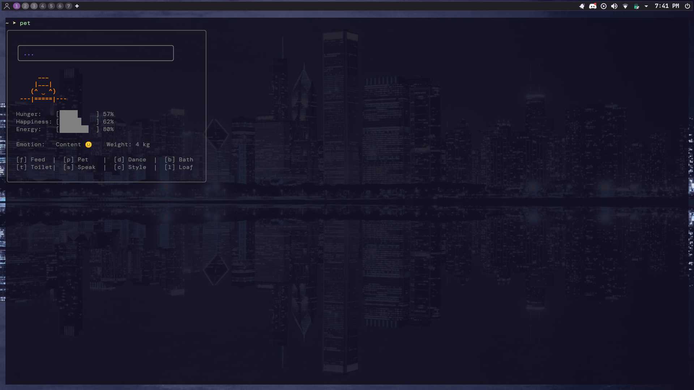

# 🐾 Puchi - The Ultimate Terminal Pet


An interactive, keyboard-driven retro tamagotchi clone built entirely inside the terminal using Go (`Bubble Tea` & `LipGloss`). Puchi features live state machines, dynamic string geometry, dynamic weights, and an internal automation engine.

## 📸 System Preview

<p align="center">
  
</p>
<p align="center"><em>Puchi, running optimized in a custom terminal environment.</em></p>

---

---

## 🛠️ Operational Core Metrics

Puchi's life cycle operates across four balancing system registers that shift over time via background system ticks:

| Stat | Mechanics | Impact |
| :--- | :--- | :--- |
| **Hunger** | Increases by +3% every 3 seconds. | Exceeding 70% drops happiness and forces a "Miserable" state. |
| **Happiness** | Decreases by -2% every 3 seconds. | Drops down based on high hunger or forced execution wakeups. |
| **Energy** | Decreases by -5% every 6 seconds. | Hitting 0% forces an immediate system collapse into deep sleep. |
| **Cache Buffer** | Increments with each food unit. | Reaching 100 units triggers a system panic / operation lock. |

---

## 🎮 Keybindings Directory

### Core Interaction Layer
* `[f]` **Feed Engine:** Reduces hunger by 20%, increases feed count/buffer, and temporarily shifts head geometry into eating mode (`🍪`).
* `[p]` **Pet Protocol:** Boosts happiness by 15% and displays optimization love text.
* `[s]` **Speak Routine:** Triggers a fast text pipe directly to your local system's `fortune` database binary to output short text parameters.
* `[t]` **Flush Buffer:** Forces a toilet break, resets current internal feed cycles back to baseline, and clears any physical system expansion (weight calculations).

### Active Routines
* `[d]` **Dance Frame:** Triggers an animated, multi-frame layout shift across tracking loops. (Requires >20% Energy).
* `[b]` **Bath Cycle:** Cleanses bytecode structures while triggering floating bubble graphics across the visual window.
* `[e]` **Power Toggle:** Gracefully lets Puchi go to sleep to recover energy, or forces him awake into an angry routine (`╬◣_◢`).

### System Modes
* `[l]` **Loaf Mode (Autopilot):** Handover control loop to internal AI automation logic. Puchi handles his own eating, sleeping, maintenance, and bathroom cache flushing based on immediate structural stat hazards.
* `[c]` **Style Wardrobe:** Suspends baseline tasks to reconfigure accessories:
  * `[1]` Brush Teeth
  * `[2]` Cycle Hair (Bald 🥚, Punk Fringe ⚡, Top Hat 🎩, Headband 🎗️)
  * `[3]` Cycle Apparel (Suit 🐳, Jacket 🧥, Tuxedo 👔, Scarf 🧣)
  * `[c / Esc]` Exit setup loop back to monitoring screen.
* `[q / Ctrl+C]` **Kill Switch:** Gracefully exits the binary runtime and cleans the terminal shell.

---

## 🧬 Engineering & Layout Details

* **Dynamic Alignment:** Accessory graphics utilize real-time cell width evaluations to dynamically snap directly over Puchi's head coordinate boundaries, preventing string layout shifting during asymmetric facial modifications.
* **Proactive Caching:** In Loaf mode, the internal cron logic detects buffer pressure hazards at `80%` capacities and automatically diverts routines to execute system flushes before encountering hard panics.

---

## ✨ Features

* **Zero Flicker:** Uses double-buffering terminal rendering for buttery-smooth animations.
* **Low Footprint:** Compiles into a single native binary with near 0% CPU idle usage.
* **Fortune-Powered:** Pressing `s` makes Puchi speak short quotes directly from your system's `fortune` database.
* **Persistent Speech:** Text wraps safely downward and freezes on screen so you can read fortunes completely at your own pace without jittering the layout walls.

---

## 🐧 Linux Installation

### 1. Prerequisites

Make sure you have `go` and the `fortune` database installed on your system:

* **Arch Linux:**
```
  sudo pacman -S go fortune-mod
```
* **Debian / Ubuntu:**

```
  sudo apt update
```
```
  sudo apt install golang-go fortune-mod fortunes-min -y
```

2. Clone & Run
Clone the repository:

```
git clone https://github.com/sahadebojyoti09-lang/terminal-pet.git
```
Move into the project directory:

```
cd terminal-pet
```
Build the optimized binary:

```
go build -o pet main.go
```
Move it to your global binaries path so it can be run from anywhere (this will request your sudo password to securely link the file):
```
sudo cp pet /usr/local/bin/
```
Now you're completely set... LAUNCH!!!!

```
pet
```

## 🪟 Windows Installation (via WSL)
If you are on Windows, you can run Puchi inside a native Linux environment using the Windows Subsystem for Linux (WSL).

### Step 1: Open WSL
Open your preferred terminal app (like Windows Terminal or PowerShell) and boot into your Linux system environment:

```
wsl
```
### Step 2: Environment Setup
If you don't have a Linux distribution set up inside WSL yet, install a clean standard distribution (like Ubuntu or Debian) from the Microsoft Store or via command line, then access its terminal shell.

### Step 3: Global Installation
Once inside your WSL Linux terminal prompt, simply follow the standard Linux Installation instructions above to update your packages, build the code, and link the binary!

Once copied to /usr/local/bin/, typing pet inside your WSL environment will instantly wake your buddy up.

